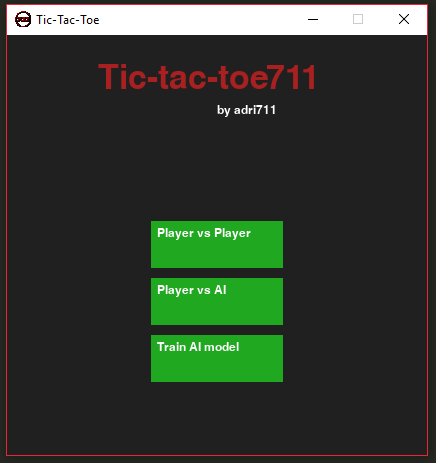
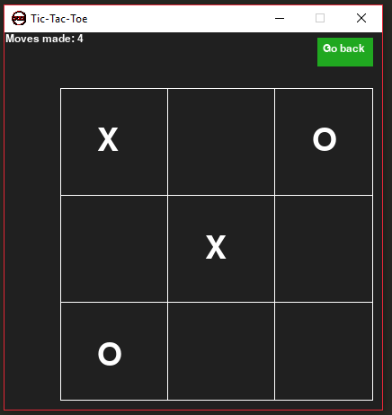
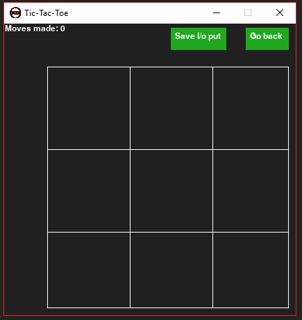

# Tic-tac-toe711
A simple Tic-Tac-Toe game that makes use of machine learning for its AI and allows you to train the model in training mode.
## dependencies
Python3
numpy
scikitlearn

## installation
1. Install the latest python3 version  https://www.python.org/
2. Clone repository
```
git clone https://github.com/adri711/m711forum-django-.git
```
3. Install the following dependencies with pip
```
pip install -U scikit-learn
pip install numpy
```
4. open a terminal inside 'game.py' folder and execute the following cmd
```
python game.py
```
## Game pictures




